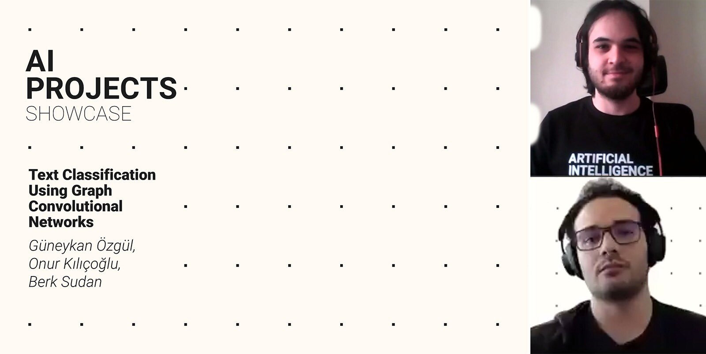

# Text Categorization Using GCN
Inzva AI Projects #4, Text Categorization Using GCN


## Build
It is applicable for only Linux distros. You can update the commands and use the equivalent ones in other distros (Mac, Windows, etc.)

Executing ```buid.sh``` will create a new _virtual environment_ in the project folder and install dependencies into that. Run the following command to build: 
```bash
bash build.sh 
```

Be sure that your computer is connected to internet. It can take a while to download and install the dependendencies.

## Run
Available Datasets:
1. 20ng
2. R8
3. R52
4. ohsumed
5. mr
6. cora
7. citeseer
8. pubmed

### 1. Preprocess
```bash
venv/bin/python3 preprocess.py <DATASET_NAME>
```
**Example:**
```bash
venv/bin/python3 preprocess.py R8
```

### 2. Train
```bash
venv/bin/python3 train.py <DATASET_NAME>
```
**Example:**
```bash
venv/bin/python3 train.py R8
```

## Contributors
- *Berk Sudan*, [GitHub](https://github.com/berksudan), [LinkedIn](https://linkedin.com/in/berksudan/)
- *Güneykan Özgül*, [GitHub](https://github.com/guneykan/),  [LinkedIn](https://www.linkedin.com/in/guneykan-ozgul)

## References

### Papers 
+ [Liang Yao, Chengsheng Mao, Yuan Luo, 2018] Graph Convolutional Networks for Text Classification: https://arxiv.org/abs/1809.05679 
+ [Kipf and Welling, 2017]  Semi-supervised classification with graph convolutional networks. InICLR.
+ [Ankit Pal] Multi-label Text Classification using Attention based Graph Neural Network
+ [Petar Velickovic] Graph Attention Networks

### Repos
+ https://github.com/Diego999/pyGAT
+ https://github.com/tkipf/pygcn

### Data Resources
+ 
